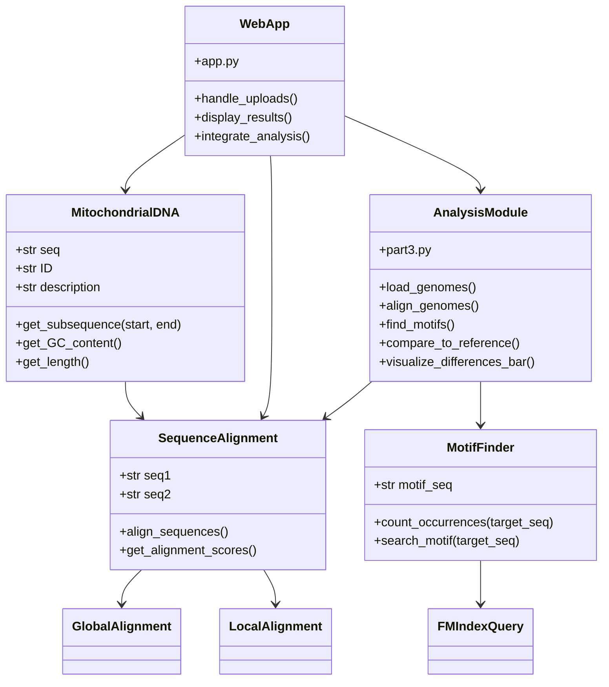

# Mitochondrial DNA Analysis Tool

A Python-based tool for analyzing mitochondrial DNA sequences, implementing sequence alignment, motif searching, and statistical analysis.

## Table of Contents
1. [Project Overview](#project-overview)
2. [System Design](#system-design)
3. [Installation](#installation)
4. [Usage](#usage)
5. [Examples](#examples)
6. [Project Structure](#project-structure)
7. [Design Documentation](#design-documentation)

## Project Overview

This tool provides functionality for:
- FASTA file parsing and data management
- Mitochondrial DNA sequence analysis
- Motif searching and pattern matching
- Global and local sequence alignment
- GC content analysis and visualization

## System Design

### CRC Cards

#### MitochondrialDNA
- **Class**: MitochondrialDNA
- **Responsibilities**:
  - Store DNA sequence data
  - Calculate sequence properties
  - Extract subsequences
- **Collaborators**: Parser, SequenceAlignment

#### MotifFinder
- **Class**: MotifFinder
- **Responsibilities**:
  - Search for patterns in sequences
  - Count motif occurrences
- **Collaborators**: FMIndexQuery

#### SequenceAlignment
- **Class**: SequenceAlignment
- **Responsibilities**:
  - Perform sequence alignments
  - Calculate alignment scores
- **Collaborators**: GlobalAlignment, LocalAlignment

#### WebApp
- **Class**: WebApp
- **Responsibilities**:
  - Handle user interactions
  - Integrate command line analysis
- **Collaborators**: MitochondrialDNA, SequenceAlignment, AnalysisModule

### UML Diagram



## Installation

1. Clone the repository:
```bash
git clone https://github.com/hades-k/dna-analysis.git
cd dna-analysis
```

2. Install dependencies:
```bash
pip install -r requirements.txt
```

## Usage

### Web Interface
1. Start the Flask server:
```bash
python app.py
```

2. Open your browser to `http://localhost:5000`

3. Upload a FASTA file and use the interface to:
   - View sequence statistics
   - Perform sequence alignments
   - Search for motifs
   - Visualize results

## Examples

### Input Example (FASTA format)
```
>NC_000001 Species_1 mitochondrion, complete genome
CCGGCAGGAACTGCTAACACATAATCGGCGTTTTGAAGTTCGCAAGGAGAGTGCCTTCCGCGTTCCCGGCTTCGTATCAA
GATATGGGACAAGGAGGGACTGTGACATTTACATGTTACGACCCCCAGTAGCTTAAATACAACGGTTTAACTACAATAGT
CGGCCGGGCAGGGTTCGGATAGGTTTACAACTACTTTTCAACATTCTCGTGATTACTAAAGCAGTCAGGCAGAAGTGATC
GAAGCGCTCTTAGATAGTGCGCCAGACCCGCTGAGCCCGCGGCATACTAGCAGTGAACCACGTTAGTACTGCTTGTATCG
ATTCGATACCCCTGAGGCCCGGACAATCTTCAGCCTTTCATAGAGAGTAAGTCTCATTTGAATTATAAACCTCGTTTATC
CGTATCCCCTGGTCCTTTAGACCCCTGTTAAGTCTCCGGCTCGTTAGCTAGCTCGTAAGTTACTGTATTACTGGGTAGCG
TTGTATAGATTTTTCGTGAGCCGTTTGGCTGCCTAGCCACAGGAACGTCAAGGCGACGGTCCCTGATGATATGTAGAGTT
GTGCTTCAGTGGGGGTCGTGGTTGACCAACAGGACCTCCTCATGCATTACACGGTGTAGTAGAAACAGTTAAAAGGTTTA
TTCAGAAACCCCTTATGGTGGCTGCTTCGCAAGCCAGTGCCCATAGTTCACGTGAGCCTAATAATGGAATATAGGCCTGT
GTGACTATGGCCGGTTCCCTTCTCAAAGGAAGGTATCTACCATCGCCGTTACGTTCACCATAAGTTAACGTAAGGCATGC
GTTCTACTCATTTTCCGCGAGGTAGCATAAGTTTTCTTAATCCACACATTGGACGCACTGGTGGGGTGAGCCAGAACCAC
GCATAGTTATAGGAGCGTGCGATTAAGCCTGCGACGACTCTTCGACCTATAACTCAAATTCATGCCACTGCTATCCAATC
ATTCTCCAATTGCGCAACATGGGATTTTACGCCGATTCTC
```

### Output Examples

1. Sequence Statistics:
```
Sequence ID: NC_000001
Description: NC_000001 Species_1 mitochondrion, complete genome
Length: 1000
GC Content: 48.2%
```

2. Motif Search:
```
Motif: GCT
Count: 14
Positions: 12, 68, 130, 245, 269, 310, 438, 446, 450, 507, 562, 660, 663, 949
```

3. Alignment Results:
```
Sequence 1 ID: NC_000001
Sequence 2 ID: NC_000002
Matches: 399
Mismatches: 532
Gaps: 138
Total Length: 1069
```

## Project Structure

```
.
├── app.py                # Flask web application
├── Part 3.py             # Analysis module
├── models.py             # Core DNA analysis classes
├── parser.py             # FASTA file parsing
├── global_alignment_algo.py  # Global sequence alignment
├── local_alignment_algo.py   # Local sequence alignment
├── fm_index_query.py     # Pattern matching
├── templates/            # HTML templates
│   ├── home.html
│   ├── statistics.html
│   ├── alignment.html
│   └── motif_search.html
├── static/              # Static files
└── uploads/             # Uploaded files
```

## Design Documentation

### Genomic Element Modeling

1. **MitochondrialDNA Class**
   - Represents individual mitochondrial DNA sequences
   - Encapsulates sequence data and analysis methods
   - Provides methods for sequence manipulation and analysis

2. **MotifFinder Class**
   - Implements pattern searching using FM-Index
   - Provides efficient motif searching capabilities
   - Returns both counts and positions of motifs

3. **SequenceAlignment Class**
   - Implements both global and local alignment algorithms
   - Provides configurable alignment parameters
   - Returns alignment results and scores

### Component Interactions

1. **Data Flow**:
   - FASTA files → Parser → MitochondrialDNA objects
   - MitochondrialDNA → SequenceAlignment for comparisons
   - MitochondrialDNA → MotifFinder for pattern searching
   - WebApp → AnalysisModule for integrated analysis

2. **Analysis Pipeline**:
   - Sequence loading and validation
   - Statistical analysis (GC content, length)
   - Motif searching
   - Sequence alignment
   - Results visualization

### Object-Oriented Principles

1. **Encapsulation**:
   - Each class encapsulates its data and methods
   - Internal implementation details are hidden
   - Clear public interfaces

2. **Abstraction**:
   - High-level sequence manipulation
   - Simplified analysis interfaces
   - Clear separation of concerns

3. **Modularity**:
   - Independent components
   - Clear interfaces
   - Easy to extend

4. **Extensibility**:
   - New analysis methods can be added
   - Support for additional file formats


### Final note 
This project was created for the Advanced Programming course at University of Bologna 
